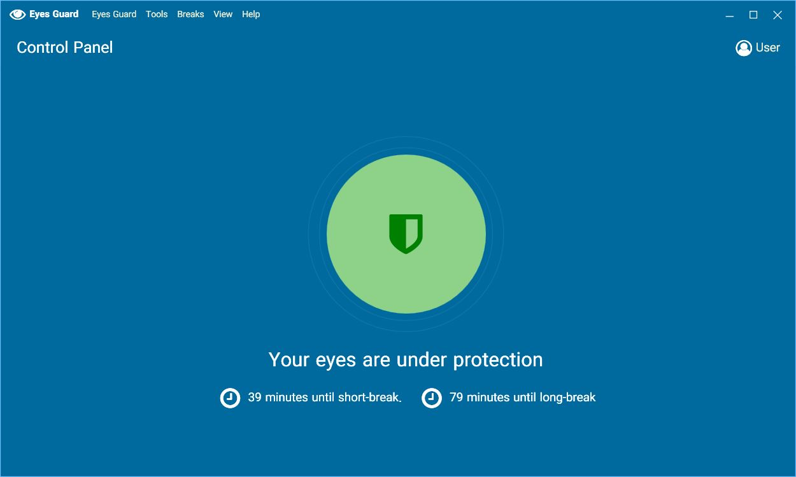
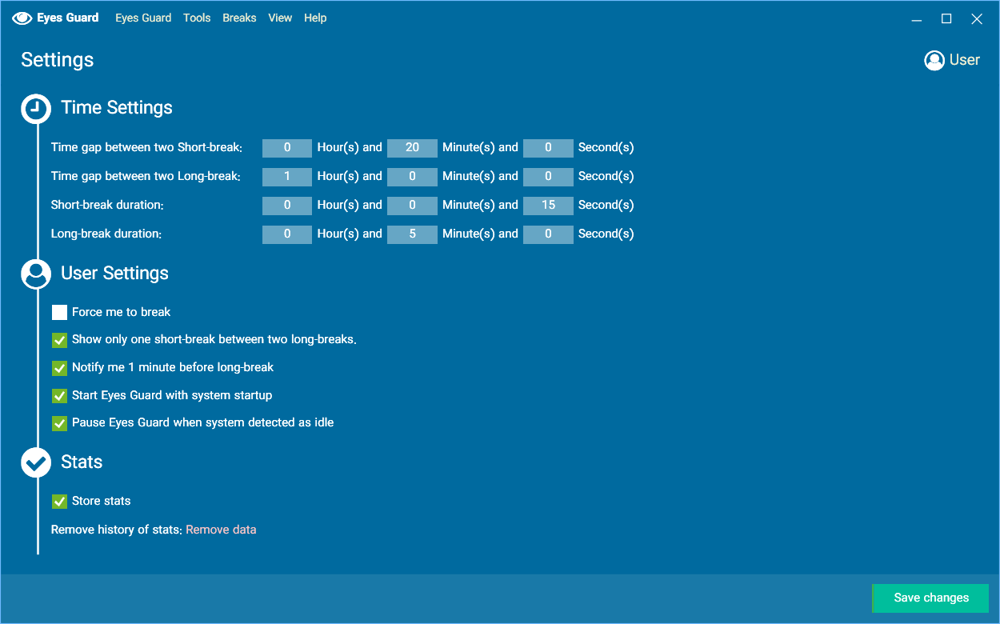

Eyes Guard
===
Windows Application for protecting you eyes 

## Screenshots
#### Control Panel

#### Settings

#### Notify Icon

---

## Features

- Short break
- Long break
- Timing customization
- Stats
- Pause or Stop Protection
- Customize short-break messages
- Multiple languages support

## Contribute
Prs are very welcome!

You can contribute to software development and/or create translations for the app.

### How to contribute to translating app
**Adding a new Language:**

1. Go to [Localization/Languages](https://github.com/0xaryan/EyesGuard/tree/master/EyesGuard/Localization/Languages) folder and create a new json file with name `{StandardCountryCode}.json` like `en-US.json` or `fa-IR.json`. Here is a [List of country codes](https://azuliadesigns.com/list-net-culture-country-codes/) you can pick.
2. Copy the content of `en-US.json` to the new created file.
3. In the meta part of json edit the `Translators` array. Remove the existing translators in the copied file and just put information of yourself.
4. Translate the `Translation` section of file and make a PR!

**Modifying a translation file:**

1. Go to [Localization/Languages](https://github.com/0xaryan/EyesGuard/tree/master/EyesGuard/Localization/Languages) and find the language you want to edit using its standard locale.
2. In the meta part of json and in the `Translators` array, add yourself as a new translator without removing others from the list.
3. Make your changes in the `Translation` section and make a PR!

**RTL Languages**

For right-to-left languages like Persian, Arabic, etc. It is not needed to explicitly state language layout in the meta section. Simply use a standard country code, and the app automatically detects if it has right-to-left direction or not and changes the design of elements in app.