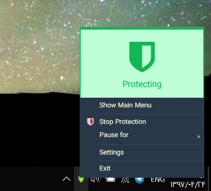

# Eyes Guard 

[](//www.microsoft.com/store/apps/9PHW0XFKZD7J?ocid=badge)
[](https://builtwithdot.net/project/41/eyes-guard)

[](https://aryansoftware.visualstudio.com/Eyes%20Guard/_build/latest?definitionId=3)


<br>

## What is Eyes Guard?
Eyes Guard is a Windows Application for protecting your eyes. It will help you (also can force you!) to break if you are working with your PC for a long time using configurable times.

## Any Screenshots?

#### Control Panel

#### Settings

#### Notify Icon


---

## What features does it have?

| Feature                  | Implementation State | Is live on store version? |
|--------------------------|----------------------|---------------------------|
| Short Break              | ✔ Implemented        | ✔ Yes                    |
| Long Break               | ✔ Implemented        | ✔ Yes                    |
| Timing Customization     | ✔ Implemented        | ✔ Yes                    |
| Stas                     | ✔ Implemented        | ✔ Yes                    |
| Pause or Stop protection | ✔ Implemented        | ✔ Yes                    |
| Windows Tray Integration | ✔ Implemented        | ✔ Yes                    |
| Auto Start               | ✔ Implemented        | ✔ Yes                    |
| Customize messages       | ✔ Implemented        | ✔ Yes                    |
| Multi-language           | ✔ Implemented        | ✔ Yes                    |

## How can I help?

Eyes Guard is a free and open-source app. If you like it, please consider:

- ⭐ Star this project in GitHub
- 📝 Write a review in [Microsoft Store page of Eyes Guard](https://www.microsoft.com/store/apps/9PHW0XFKZD7J?ocid=badge)
- [](https://ko-fi.com/P5P011XLE)
- 👩‍💻 Contribute to Software Development of Eyes Guard
- ✏ Translate app to your language using guide below

## Supported Languages

| |Language|Locale|Translator|
|-|--------|------|----------|
|![us][us]|English|en-US|[Aryan Ebrahimpour](https://aryan.software), [Gianpaolo Filippa](https://github.com/gianpaolof), [Akash Joshi](https://akashj.com)|
|![ir][ir]|Persian|fa-IR|[Aryan Ebrahimpour](https://aryan.software)|
|![it][it]|Italian|it-IT|[Gianpaolo Filippa](https://github.com/gianpaolof)|
|![fr][fr]|French|fr-FR|[Bouillon Pierre](https://pbouillon.github.io)|
|![ru][ru]|Russian|ru-RU|[Dmitry Vorobjev](https://github.com/ExplorerOL)|
|![add][add]|[Add Language](#how-to-contribute-to-translating-app)||You|

[us]: https://img.icons8.com/color/48/000000/usa.png
[ir]: https://img.icons8.com/color/48/000000/iran.png
[it]: https://img.icons8.com/color/48/000000/italy.png
[fr]: https://img.icons8.com/color/48/000000/france.png
[ru]: https://img.icons8.com/color/48/000000/russian-federation.png
[add]: https://img.icons8.com/doodle/48/000000/add.png

## Can I contribute?

PRs are very welcome!

You can contribute to software development and/or create translations for the app.

### How to contribute to translating app

#### Method 1 : using GitHub
<hr>

Adding a new Language:

1. Go to [Languages](https://github.com/0xaryan/EyesGuard/tree/master/Source/EyesGuard.Data/Languages) folder and create a new yaml file with name `{StandardCountryCode}.yml` like `en-US.yml` or `fa-IR.yml`. Here is a [List of country codes](CountryCodes.md) you can pick.
2. Copy the content of `en-US.yml` to the new created file.
3. In the meta part of yaml edit the `Translators` array. Remove the existing translators in the copied file and just put information of yourself.
4. Translate the `Translation` section of file and make a PR!

Modifying a translation file:

1. Go to [Languages](https://github.com/0xaryan/EyesGuard/tree/master/Source/EyesGuard.Data/Languages) and find the language you want to edit using its standard locale.
2. In the meta part of yaml and in the `Translators` array, add yourself as a new translator without removing others from the list.
3. Make your changes in the `Translation` section and make a PR!

#### Method 2 : using Email
<hr>
Use the links mentioned in above method, modify/add translation file, then email it to me: Oxaryan@outlook.com

### 📜 RTL Languages

For right-to-left languages like Persian, Arabic, etc. It is not needed to explicitly state language layout in the meta section. Simply use a standard country code, and the app automatically detects if it has right-to-left direction or not and changes the design of elements in app.

## 📐 Solution Structure

| Project Name   | Language | Description                                  |
|----------------|----------|----------------------------------------------|
| EyesGuard      | C#       | Main Application (at the time of starting project I didn't know F# to write the app entirely in F#)|
| EyesGuard.Data | F#       | Type Provider and Data Access / Translations |
| StorePackage   |          | Used to publish WPF app into Store           |

## 🔨 Build

You need [Paket Package manager for .NET](https://fsprojects.github.io/Paket) to restore the packages.

```powershell
git clone https://github.com/0xaryan/EyesGuard
cd .\EyesGuard
paket install
cd .\Source\EyesGuard
dotnet run
```
